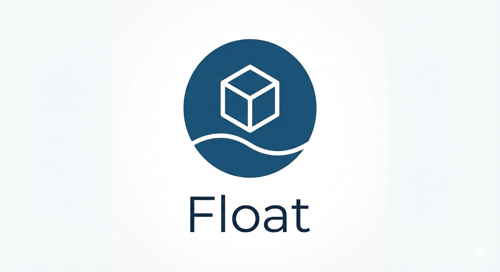

<p align="center">
  
</p>


[](https://vercel.com/new/clone?repository-url=https%3A%2F%2Fgithub.com%2Fx0root%2Ffloat)
[](https://codespaces.new/x0root/float)

Note: Float runs on Vercel, but you can't create multiple containers/VMs there (the Manager spawns child processes/ports).

# Float - Browser-Based Linux Container Platform

Run Linux containers in your browser via WebAssembly. Debian runs client-side; optional server endpoints provide a command API and an HTTP gateway.

Float is an open-source, client-side containerization platform that runs full Linux environments directly in the browser through WebAssembly. Built on CheerpX's x86 emulation and JIT engine, it enables developers to spin up multiple isolated Debian containers from a single disk image, all running entirely on the client side without backend infrastructure.

With its container management API and Docker-inspired orchestration, Float lets developers programmatically control, connect to, and manage containers through a familiar interface, while offloading compute costs from servers to users' browsers. 

---

## Features

- **Client-side VM execution**: CheerpX runs in the browser; no backend required to execute the VM.
- **Debian and Alpine images**: Debian terminal route and Alpine GUI route.
- **Headless runner**: Optional Puppeteer automation for API-driven execution.
- **HTTP gateway**: Optional server-side proxy so the VM can fetch external URLs.
- **Disk streaming**: Root filesystem is an ext2 image streamed on demand.

---

## Architecture

```
┌─────────────────────────────────────────────────────────────┐
│                    BROWSER (Client)                        │
│  ┌─────────────┐  ┌─────────────┐  ┌─────────────────────┐ │
│  │   Float     │  │   xterm.js  │  │   Service Worker    │ │
│  │  (Svelte)   │  │  Terminal   │  │ (Lazy Disk Loading) │ │
│  └──────┬──────┘  └─────────────┘  └─────────────────────┘ │
│         │                                                    │
│  ┌──────▼────────────────────────────────────────────────┐ │
│  │         CheerpX JIT Engine (WebAssembly)               │ │
│  │  • x86 → Wasm JIT Compilation                        │ │
│  │  • Linux syscall emulation                           │ │
│  │  • ext2 filesystem support                           │ │
│  └──────┬─────────────────────────────────────────────────┘ │
└─────────┼────────────────────────────────────────────────────┘
          │
          ▼
┌─────────────────────────────────────────────────────────────┐
│                SERVER (Optional - for API)                   │
│  ┌─────────────────┐  ┌──────────────────────────────────┐ │
│  │  Command Queue  │  │      HTTP Gateway (Internet)     │ │
│  │   API Bridge    │  │  /api/gateway → proxy to web    │ │
│  └─────────────────┘  └──────────────────────────────────┘ │
└─────────────────────────────────────────────────────────────┘
```

### How It Works

1. **CheerpX Virtual Machine**: The core engine JIT-compiles x86 instructions to WebAssembly in real-time. It emulates Linux syscalls and provides virtual block devices and network interfaces.

2. **Disk Images**: Linux filesystems (ext2 format) are streamed on-demand over WebSocket connections. Only the disk sectors needed by running processes are fetched, with local caching via IndexedDB for performance.

3. **HTTP Gateway**: A server-side proxy endpoint (`/api/gateway`) allows the VM to fetch external web resources. Requests are initiated from inside the VM by printing marker strings in the terminal output. The host UI intercepts markers and performs the fetch.

4. **Headless Runner**: A Puppeteer-based automation script runs the VM in a headless Chrome instance, enabling API-driven command execution without a visible browser window.

5. **Container Management API**: REST endpoints allow programmatic control - submit commands, retrieve output, and manage multiple container instances remotely.

---

## Quick Start

### 1. Installation
```bash
git clone https://github.com/x0root/float
cd float
npm install
```

### 2. Configuration (`.env`)
Create a `.env` file to configure your environment:

```ini
# Security: Key required to authorize API commands
API_KEY=your-secret-api-key-here

# Storage: WebSocket URL for the Debian disk image
# Default: wss://disks.webvm.io/debian_large_20230522_5044875331.ext2
DISK_SOURCE=wss://disks.webvm.io/debian_large_20230522_5044875331.ext2

# Manager dashboard login (optional)
MANAGER_USER=manager
MANAGER_PASSWORD=change-me

# Optional. If not set, the manager session token signing secret uses API_KEY.
# MANAGER_SESSION_SECRET=...
```

### 3. Development Server
```bash
npm run dev
# Access UI: http://localhost:5173 (Debian Terminal)
# Alpine GUI: http://localhost:5173/alpine
```

### 4. Headless Mode (Background Execution)
```bash
# Auto-runs with `npm run dev` or separately:
npm run headless
```

---

## Manager Dashboard (WebVM Instance Management)

Float includes a manager dashboard that can spawn and control multiple independent WebVM instances.

### What the manager does

- **Create VM**: starts a dedicated `vite preview` server on its own port and a dedicated headless runner for background execution.
- **Terminate**: stops the VM (kills both the per-VM preview server and the headless runner).
- **Start**: starts a previously terminated VM again.
- **Rename**: changes the displayed name.
- **Delete**: removes the VM record from the manager list.

### Access

- **Dashboard**: `http://localhost:5173/manager`
- **Login**: `http://localhost:5173/manager/login`

The manager uses an HTTP-only cookie session. All manager API routes require being logged in.

### Per-VM URLs and ports

Each created VM has its own URL (example):

- `http://localhost:48566/`

The manager will show a clickable **Run at** link that passes `?api_key=...` so the VM UI can automatically configure the API key for gateway features.

### Per-VM headless logs

Each per-VM headless runner writes logs to:

- `.webvm-logs/<vmId>.headless.log`

This is the first place to check if commands are stuck or the runner fails to start.

### Serverless (Vercel) limitation

The **Manager dashboard VM spawning feature** is designed for a persistent Node.js server.

On serverless platforms like **Vercel**, the manager will not be able to create or reliably “detect” VMs because:

- **No long-running child processes**: the manager spawns per-VM processes (a `vite preview` server and a Puppeteer headless runner). Serverless functions cannot keep these running.
- **No shared in-memory state**: the VM registry is stored in-memory, which does not persist across serverless invocations/cold starts.
- **No dynamic localhost ports**: per-VM URLs are `http://localhost:<port>` and serverless platforms do not expose arbitrary ports.

#### Recommended deployment options

- **Local / VPS / persistent VM**: run the manager on a machine that can spawn and keep processes alive.
- **Vercel for UI + external runners**: host the UI on Vercel, but run the headless runners and manager on a persistent host and store registry state in an external DB/Redis.

---

## Usage Guide

### Interactive Terminal
The default route (`/`) provides a full Debian terminal running `/bin/bash` with a complete user environment (vim, python, curl, etc.).

### Alpine Linux GUI
Visit `/alpine` for a graphical Alpine Linux experience with `/sbin/init` and display support.

### Remote API Control
Execute commands programmatically via the headless runner:

```bash
# Submit command
curl -X POST "http://localhost:5173/api?api_key=YOUR_KEY" \
  -H "Content-Type: application/json" \
  -d '{"cmd":"python3 -c \"print(2+2)\""}'
```

#### PowerShell example

```powershell
$params = @{
    Uri         = "http://localhost:48566/api?api_key=YOUR_KEY"
    Method      = "POST"
    ContentType = "application/json"
    Body        = (@{ cmd = 'python3 -c "print(2*15)"' } | ConvertTo-Json)
}

Invoke-RestMethod @params
```

### Command API (`/api`)

The command API is a queue:

- **POST `/api?api_key=...`**
  - Send `{ "cmd": "..." }` to enqueue a command.
  - By default it waits up to 60 seconds for the headless runner to complete the command.
  - If it times out waiting, it returns `status: pending` and you can poll.

- **GET `/api?action=pending&api_key=...`**
  - Used by the headless runner (CommandExecutor) to fetch the next command.

- **GET `/api?commandId=...&api_key=...`**
  - Poll the result of a command.

### HTTP Gateway (`/api/gateway`)

- **POST `/api/gateway?api_key=...`**
  - Used by the VM UI to proxy URL fetches from inside the VM.
  - This enables `curl`, `wget`, and related workflows via the marker protocol described below.

### Manager API (`/api/manager/webvm`)

- **GET `/api/manager/webvm`**
  - Returns the current VM list (plus the API key for generating "Open" links).

- **POST `/api/manager/webvm`**
  - Body contains `action`:
    - `create`: `{ action, name, port?, diskSource? }`
    - `terminate`: `{ action, id }`
    - `start`: `{ action, id }`
    - `rename`: `{ action, id, newName }`
    - `delete`: `{ action, id }`

The manager API requires being logged into the manager dashboard (cookie session).

### Internet Access from VM
Run standard networking commands inside the VM:

```bash
curl https://example.com
wget https://example.com/file.txt
```

These requests are intercepted via terminal markers (`__FETCH__...__ENDFETCH__`), forwarded through the HTTP Gateway, and responses are injected back into the terminal output.

### Network Gateway: Technical Details

#### What the gateway is
The gateway is a normal HTTP endpoint implemented in SvelteKit:

- **Endpoint**: `POST /api/gateway?api_key=...`
- **Purpose**: fetch a URL from the host environment and return data to the VM.

The VM itself does not have a full network stack or DNS in the browser sandbox. Instead, the UI proxies web requests.

#### How it works in this project (end-to-end)

- **1) A VM-side helper emits markers**
  - A small Python script is written into the VM as `/tmp/net` (see `src/lib/net_gateway.js`).
  - When you run `/tmp/net curl https://example.com`, it does not open sockets.
  - Instead it prints a marker to stdout like `__FETCH__https://example.com__ENDFETCH__` and waits for a response terminated by `__ENDRESPONSE__`.

- **2) The browser UI intercepts those markers**
  - The main VM UI component (`src/lib/WebVM.svelte`) scans the terminal output stream for these markers.
  - When it finds one, it extracts the URL and calls `handleFetch(...)`.

- **3) The UI calls the host gateway endpoint**
  - `handleFetch(...)` performs a `fetch('/api/gateway?api_key=...')` POST with JSON `{ url, method, responseType }`.
  - The API key is taken from `localStorage['webvm-api-key']` (or from `?api_key=...` which the UI seeds into localStorage).

- **4) The server performs the real network request**
  - The SvelteKit endpoint (`src/routes/api/gateway/+server.js`) validates the API key and runs `fetch(targetUrl)` from the host environment (Node).
  - It returns the response as JSON:
    - `data` for text
    - `data_b64` for binary (base64)
    - `headers/status/statusText` for HEAD/header-only mode

- **5) The UI injects the response back into the VM session**
  - The UI writes the returned data back into the VM’s stdin/terminal stream and appends `__ENDRESPONSE__`.
  - The VM-side helper reads until it sees `__ENDRESPONSE__` and then prints/saves the content.

This is intentionally a **URL-fetch bridge**, not a full TCP/UDP network stack.

#### Marker protocol
The WebVM terminal output is scanned for markers:

- **Text fetch**: `__FETCH__<url>__ENDFETCH__`
- **Header-only (HEAD) fetch**: `__FETCH_HEAD__<url>__ENDFETCH_HEAD__`
- **Binary fetch (base64-encoded)**: `__FETCH_B64__<url>__ENDFETCH_B64__`

The UI injects the response back to the VM, terminated by:

- `__ENDRESPONSE__`

#### Limitations
- This is **not** a general-purpose socket/network layer. It is a URL fetch bridge.
- Large responses can be slow (especially binary/base64) and may hit timeouts.
- Only the host can see the real network; the VM cannot directly resolve DNS.

#### Relation to CheerpX networking customization
CheerpX does have internal networking integration points, but they are not documented publicly yet.

Float does **not** depend on undocumented CheerpX APIs for networking.

Instead, this repo implements networking as an explicit, auditable proxy layer:

- The VM requests a URL by printing markers
- The UI forwards the request to a normal HTTP endpoint
- The endpoint does the real network `fetch` and returns data
- The UI injects the response back

This keeps the approach portable across hosts (local Node, VPS) and avoids relying on internal CheerpX hooks.

---

## Security

**WARNING**: Float executes binary code in your browser sandbox.

- **Browser Isolation**: Runs inside WebAssembly sandbox - cannot access host OS files
- **API Key Protection**: All `/api` endpoints require `API_KEY` authentication
- **Network Segmentation**: VM "localhost" is isolated from host localhost
- **No Privileged Operations**: All VM operations are unprivileged (uid 1000 in Debian)

---

## Development

### Project Structure
```
src/
├── lib/
│   ├── WebVM.svelte          # Main VM component (CheerpX integration)
│   ├── rpc_scripts.js        # VM-side curl/wget proxy script
│   ├── net_gateway.js        # VM-side /tmp/net helper (curl/wget + HEAD)
│   ├── commandExecutor.js    # API command polling
│   ├── activities.js         # CPU/disk activity monitoring
│   └── ...
├── routes/
│   ├── api/                  # API endpoints (gateway, command queue)
│   ├── alpine/               # Alpine Linux GUI route
│   └── remote/               # Remote console UI
├── app.html                  # HTML shell with CheerpX loader
scripts/
└── headless-webvm.js         # Puppeteer automation
```

### Customizing the Debian Image with Docker

The Debian environments used by Float are built from the Dockerfiles in `dockerfiles/`.

- `dockerfiles/debian_mini`
  - Smaller package set.
- `dockerfiles/debian_large`
  - Larger package set.

Both Dockerfiles:

- Start from an i386 Debian base image (`i386/debian:bookworm`).
- Install packages via `apt-get install ...`.
- Create a `user` account and set passwords (`user:password`, `root:password`).
- Copy `./examples` into `/home/user/examples`.

If you modify the package list in either Dockerfile, it changes what tools are present inside the VM image (for example adding/removing `vim`, `python3`, `gcc`, etc.).

#### How the Dockerfile affects the VM
The VM root filesystem is an ext2 disk image derived from the container filesystem produced by these Dockerfiles. The app points at a specific prebuilt disk image URL (see `config_public_terminal.js` and `.env`). Updating the Dockerfiles does not change the running VM until you rebuild and host a new disk image.

#### High-level rebuild flow
1. Edit `dockerfiles/debian_mini` or `dockerfiles/debian_large`.
2. Build the Docker image.
3. Export the filesystem and convert it into an ext2 disk image.
4. Host the ext2 image on a server that supports range requests / streaming.
5. Update `DISK_SOURCE` to point at your new disk image.

Exact image build/export steps depend on your environment and hosting choice. The key point is:

- **Dockerfile change** -> **new disk image build** -> **update `DISK_SOURCE`**

---

## Contributing

1. **Fork** the repository
2. **Create** a feature branch: `git checkout -b feature/cool-thing`
3. **Commit** your changes
4. **Push** to the branch
5. **Open** a Pull Request

---

Powered by [Leaning Technologies](https://leaningtech.com)

---

## Troubleshooting

### VM API returns `pending` and never completes

This means the per-VM headless runner is not executing queued commands.

- Check the per-VM headless log:
  - `.webvm-logs/<vmId>.headless.log`
- Ensure the VM was created from the manager while running on a persistent Node process (not serverless).

### Browser shows `ERR_UNSAFE_PORT`

Some ports are blocked by browsers. If you pick a blocked port, the VM UI will not load.

- Let the manager auto-select a port (leave Port empty)
- Or choose a safe port (examples: `4173`, `5173`, `5637`, and other non-blocked ports)

### Windows notes

- Per-VM servers are started by invoking the Vite CLI via Node directly to avoid Windows `spawn` issues.
- If a per-VM runner fails to start, inspect the `.webvm-logs` file for the error.

### Serverless platforms (Vercel)

VM creation/start is disabled on serverless platforms because they cannot spawn persistent child processes.
